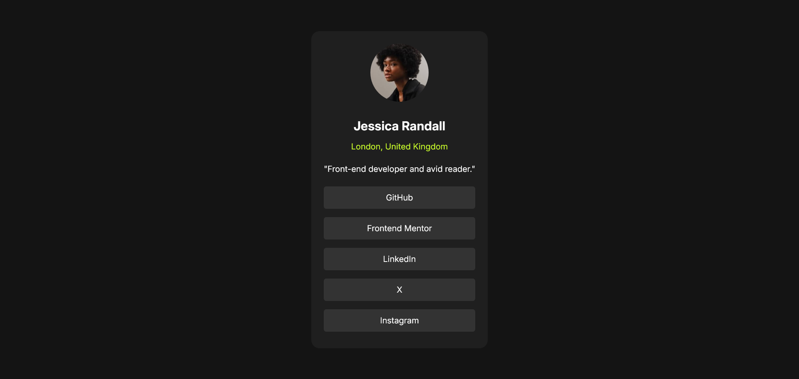

# Frontend Mentor - Social links profile solution

This is a solution to the [Social links profile challenge on Frontend Mentor](https://www.frontendmentor.io/challenges/social-links-profile-UG32l9m6dQ). Frontend Mentor challenges help you improve your coding skills by building realistic projects. 

## Table of contents

- [Overview](#overview)
  - [Screenshot](#screenshot)
  - [Links](#links)
  - [Built with](#built-with)
- [Author](#author)

## Overview

Social links profile page built using HTML/CSS

### Screenshot

### Links

- Solution URL: [GitHub](https://github.com/TieFit/social-links-profile)
- Live Site URL: [Social Links Profile](https://tiefit.github.io/social-links-profile/)

### Built with

- Semantic HTML5 markup
- CSS custom properties
- Flexbox
- Mobile-first workflow

## Author

- Website - [GitHub](https://github/TieFit/social-links-profile)
- Frontend Mentor - [@yourusername](https://www.frontendmentor.io/profile/TieFit)
